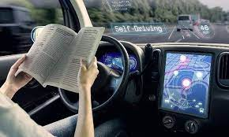

5 - Implicaciones éticas y sociales
-

### 5.1. Sesgo en la predicción realizada

La Inteligencia Artificial toma cada vez más decisiones relevantes que pueden impactar en nuestras vidas. Por eso, es necesario que se compruebe que las decisiones que toma son justas y no tienen sesgos llevando a tomar decisiones discriminatorias. La IA, y en particular el aprendizaje
automático, se utiliza para tomar decisiones importantes en muchos sectores.

Con ello, surge el concepto de «sesgo algorítmico», que apunta a la incorporación de una tendencia a discriminar en función del origen étnico, el género u otros factores a la hora de tomar decisiones sobre solicitudes de empleo, préstamos bancarios, etc. Si la Inteligencia Artificial usa el
aprendizaje automático supervisado, debido a que el entrenamiento del sistema es supervisado por una persona, el sistema de valores y los prejuicios de esa persona pueden introducirse en el sistema.

Los sistemas de Inteligencia Artificial también pueden tener sesgos debido al conjunto de datos que usan para poder hacer predicciones. Si el conjunto de datos que le pasamos al algoritmo está sesgado, el sistema también lo estará. Estos sesgos pueden aparecer incluso de forma inintencionada, por ejemplo, por falta de datos de un determinado subgrupo.

Muchas veces cambiando la forma de recolección de los datos podemos reducir los sesgos manteniendo la capacidad y precisión predictiva. Es mejor tener menos datos pero que los grupos estén correctamente representados que tener más datos con algún grupo infrarrepresentado.

### 5.2. Cambia el concepto de privacidad

Los sistemas de Inteligencia Artificial pueden violar el anonimato de datos que pensamos que están seguros. Por ejemplo, unos investigadores de la Universidad de Texas estudiaron un conjunto de datos públicos facilitado por Netflix en el que había 10 millones de puntuaciones de
películas dadas por unos 500 000 usuarios anónimos, y demostraron que, en realidad, se podía vincular a muchos de los usuarios de Netflix con cuentas de usuario de Internet Movie Database porque habían puntuado varias películas en ambas aplicaciones. De este modo, los investigadores
fueron capaces de desanonimizar los datos de Netflix. Esto que en principio parece inofensivo puede revelar aspectos de nuestras vidas como las ideas políticas o nuestros gustos sexuales que deberían permanecer en secreto.

Otro ejemplo son los patrones de tecleo, es decir, los intervalos breves de tiempo entre las pulsaciones de las teclas cuando se escribe un texto. Sabiendo tu patrón de tecleo pueden averiguar si has usado otro servicio, aunque no te hayas identificado.

Además, muchas empresas tecnológicas como Google, Amazon o Instagram recopilan datos sobre las compras que haces y otros datos de navegación para poder ofrecerte publicidad que esté
personalizada a tus gustos.

### 5.3. Cambios en el trabajo

La introducción de la Inteligencia Artificial en el trabajo supone cambios en el trabajo eliminando la necesidad de algunos trabajos repetitivos y aburridos. Según un estudio de la Universidad de Oxford, el 47% de los puestos de trabajo de Estados Unidos podrían estar en riesgo.

